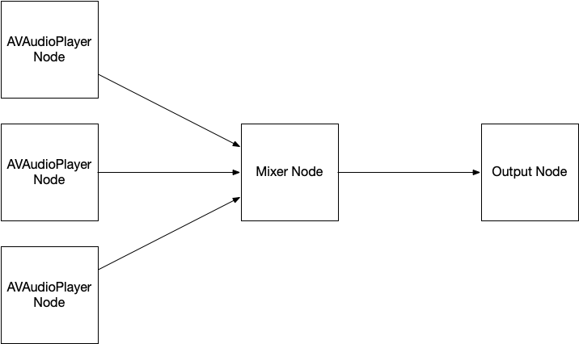
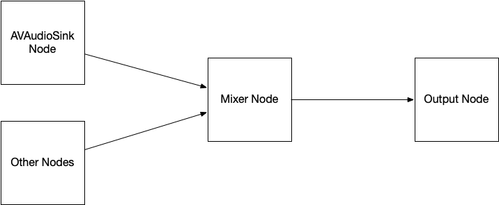
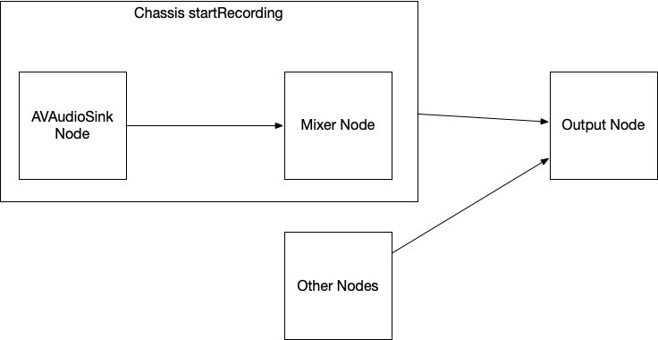

# Chassis-iOS
A wrapper for AVAudioEngine to help create basic and prosumer multi-track audio applications on iOS.

Chassis is written to abstract away some of the gritty parts of CoreAudio present in multi-track AVAudioEngine usage.

AVAudioEngine works on the basis of AVAudioNodes connected to a mixer node, and then to an output node, much like a recording studio would connect sources to destinations.


Chassis abstracts this away by using a `Track` model and a simple `loadAllTracksAndAddToMix` method to add an array of audio files to a node, then to the mixer, and the output.


This saves the end user the trouble of managing audio files, urls, and nodes separately.

Similarly, AVAudioEngine's `AVAudioSinkNode` provides a way to record input into a file that utilizes Core Audio's ring buffer pattern to populate a new file with the incoming data.


Chassis attempts to abstract this away as well by providing a single `startRecording` and `stopRecording` function pair to connect the sink node and populate a file.


To create an instance of Chassis' engine, simply instantiate AudioEngine.
```
import Chassis

...
private var engine: AudioEngine = AudioEngine()
...
```

To add a file to a mix, create a `Track` object, and call `loadAllTracksAndAddToMix`.

```
import Chassis

...
let newTrack = Track(urlString: Bundle.main.url(forResource: "M1F1-int16s-AFsp",
                                                withExtension: "aif")!.lastPathComponent,
                     startTime: nil)
engine.loadAllTracksAndAddToMix(tracks: [newTrack])
...
```

Chassis is not meant to be a pro-audio framework, as it abstracts away certain sample-locked parts from the user.
Having said that, its main purpose is to facilitate the entry-point to multi-track audio for consumer applications on iOS.

Chassis relies on Combine, so I have decided to make it iOS 13 +. 

I'll soon be updating this file with a (long!) list of issues I'd like to address...collaborators are welcome!

I will also be updating this readme with notes about how Chassis is written, and some of its shortcomings.

Until I can do that, please feel free to write me directly at rawbirdtoe --(at)-- g mail dot com.
